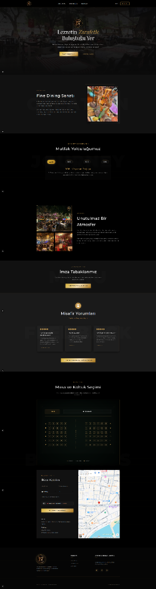

# 🍷 EV Bar & Kitchen — Premium Fine Dining & Booking System

EV Bar & Kitchen is a high-end, fully responsive web application built with **Next.js (App Router)** and **Prisma ORM (SQLite)**. Inspired by luxury aesthetics and fine dining culture, the system offers an interactive experience planner, seat-mapping reservation, a custom admin dashboard, and seamless multi-language support.

---

## 📸 Showcase & Preview

<p align="center">
  
</p>

---

## ✨ Features

### 🎨 Premium Visual Identity & Design System
* **SVG Grain (Noise) Filter:** Overlaid on the entire site (`opacity: 0.035`) to create an organic, premium paper-like texture.
* **Ambient Lighting Effects:** Slowly floating gold and emerald green halo elements (`.ambient-halo`) that give a mysterious, high-end atmosphere.
* **Glassmorphism Components:** Sleek, glass-like cards and modals using `backdrop-filter: blur(12px)`.
* **Micro-Animations:** Fluid, interactive transitions on buttons, maps, menu selections, and seat maps.

### 🌐 Seamless 4-Language Architecture (i18n)
* Fully supports **Turkish (TR)**, **English (EN)**, **Russian (RU)**, and **Norwegian (NO)**.
* Language switching happens instantly on the client side without page reload.
* Centralized dictionary structure located in `src/lib/translations.ts`.

### 🪑 Seat Mapping & Interactive Experience Planner
* **Interactive Seating Layout:** Direct seat selection from a grid split into **Left (L)** (30 seats) and **Right (R)** (36 seats) blocks, featuring a central corridor, a custom `🍸 BAR` section, and a `🎭 STAGE` view.
* **Experience Configurator:** Customers can select culinary packages, custom wine pairings, and premium add-ons (such as private VIP lounges or luxury limousine shuttles).
* **Live Invoicing Paper:** Calculations update dynamically. The bill scales with selected seats, package rates, and one-off add-ons, displaying a realistic invoice receipt.

### 💼 Admin Management Suite
* Fully integrated admin panel (`/admin`) to oversee pending/confirmed/cancelled reservations, manage table mappings, and update menu listings.
* Integration with SQLite via Prisma ORM for persistent data management.
* Out-of-the-box support for Prisma Studio.

---

## 🛠️ Technology Stack

* **Core Framework:** Next.js (App Router, Client & Server Components)
* **Language:** TypeScript
* **Database & ORM:** SQLite + Prisma ORM
* **Styling:** Vanilla CSS (Tailored Design System)
* **Mail System:** Nodemailer (For automated verification and notification emails)

---

## 📂 Project Structure

```text
├── prisma/
│   ├── schema.prisma   # SQLite Database schema definitions
│   └── dev.db          # Main database file
├── public/
│   └── assets/         # Project images, textures, videos, and preview files
├── src/
│   ├── app/            # Next.js Page & API routing
│   │   ├── admin/      # Management dashboard view
│   │   ├── api/        # Next.js API Routes (menu, gallery, reservations)
│   │   ├── menu/       # Menu page view
│   │   └── page.tsx    # Immersive homepage and seat planner
│   ├── components/     # Navbar, Footer, and PageWrapper elements
│   ├── context/        # Multilingual state management
│   └── lib/            # Shared translation files, mock data, and mailer configs
├── seed.js             # Seed script to populate food, drink, and gallery items
└── package.json        # Project scripts and library dependencies
```

---

## 🚀 Getting Started

### 1. Installation
Clone the repository and install dependencies:
```bash
npm install
```

### 2. Database Setup & Seed
Initialize the SQLite database with Prisma migrations and seed default records:
```bash
npx prisma migrate dev --name init
node seed.js
```

### 3. Running Locally
Start the local Next.js development server:
```bash
npm run dev
```
Open [http://localhost:3000](http://localhost:3000) in your browser.

### 4. Admin Management (Prisma Studio)
Visualize and manage database tables (Reservations, Menu items) easily:
```bash
npx prisma studio
```
This opens a database UI on [http://localhost:5555](http://localhost:5555).

---

## ✉️ Env Configuration
Configure SMTP credentials inside your environment file (`.env`) to enable email dispatch via Nodemailer whenever reservations are submitted.
```env
DATABASE_URL="file:./dev.db"
SMTP_USER="your-email@example.com"
SMTP_PASS="your-smtp-password"
```
